Mini Data Analysis: Report 2
================
Harsh Sharma
21/10/2021

## Overview

This report continues the exploratory data analysis performed in Report1
on the ‘cancer\_dataset’ chosen from the `datateacher` package.
Incremental effort will be placed in exploring in more detail the
dataset in a fashion that will lead to geenrating insights to answer the
research questions.

## Set-up

First we need to load the following two packages:

``` r
# Installing packages if missing, required only once
# install.packages("devtools")
# devtools::install_github("UBC-MDS/datateachr")

library(datateachr)
library(tidyverse)
```

## Task1: Processing and Summarizing Data

From earlier analysis we know the cancer\_dataset has the following high
level characteristics:

-   Shape is: 569, 32

-   Data class is: spec\_tbl\_df, tbl\_df, tbl, data.frame

### Task 1.1: Research Questions

Following are the research questions formulated in Report1:

1.  **Can a binary (malignant or benign) classification model be
    generated the given variables and dataset?**

2.  **Is data distribution/characteristics comparable between the benign
    and malignant classes?**

3.  **What variable(s) can be used to model the response?** Which next
    leads us to finding the optimized set of variables having the
    highest model performance. This inherently involves analyzing the
    three associated columns for the same parameter (example:
    radius\_mean, radius\_se, radius\_worst) in order to minimize
    redundancy.

4.  **Identifying what variable(s) contributes to the highest model
    sensitivity**. In this problem setting it is better to have a false
    positive than a false negative.

*PS: Research question 4 has been replaced in the following section due
to better alignment with this report’s instruction requirement and also
the course scope.*

### Task 1.2: In-depth EDA

In this section, at least one summarizing and one graphing task is
attempted per research question.

#### Question1 - Generating binary classification model

(Pt 1) Computing the summary statistic of numeric variable
‘radius\_mean’ across the categorical variable ‘diagnosis’:

``` r
# First grouping by diagnosis
# Using dyplr::unite() to output range as asked in question

cancer_sample %>%
  group_by(diagnosis) %>%
  summarize(min_value=min(radius_mean), max_value=max(radius_mean), mean=mean(radius_mean,na.rm=TRUE),median=median(radius_mean), sd=sd(radius_mean)) %>%
  unite(range, min_value, max_value, sep="-")
```

    ## # A tibble: 2 x 5
    ##   diagnosis range        mean median    sd
    ##   <chr>     <chr>       <dbl>  <dbl> <dbl>
    ## 1 B         6.981-17.85  12.1   12.2  1.78
    ## 2 M         10.95-28.11  17.5   17.3  3.20

(Pt 5) Graphing mean\_radius with at least two geom layers:

``` r
# Using classic theme to maximize pixel-info ratio per best practices 

cancer_sample %>%
  ggplot(aes(diagnosis, radius_mean))+
  geom_boxplot(width=0.2)+
  geom_jitter(alpha=0.1, width=0.2)+
  theme_classic()
```

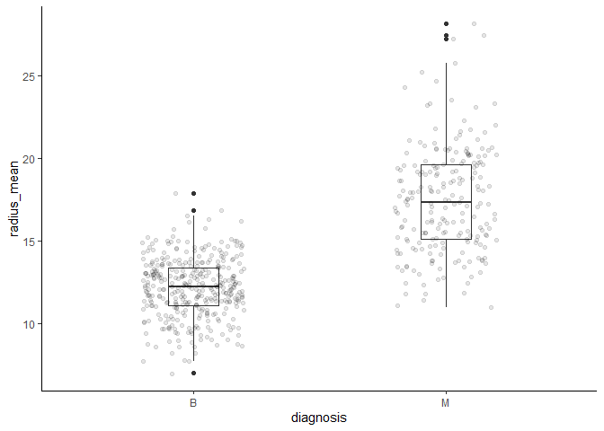<!-- -->

The above results clearly indicate discernible difference in variable
‘radius\_mean’ across benign and malignant diagnosis. This is strong
indicator that binary classification is possible.

*Note: Classification model will be generated as part of Report3*

#### Question2 - Comparing benign and malignant data distribution

(Pt 2) Computing the number of observations for categorical variable
‘diagnosis’:

``` r
# Without using table() as the output is not data frame

cancer_sample %>%
  group_by(diagnosis) %>%
  tally()
```

    ## # A tibble: 2 x 2
    ##   diagnosis     n
    ##   <chr>     <int>
    ## 1 B           357
    ## 2 M           212

Plotting graph of choice, to examine is there is class imbalance:

``` r
cancer_sample %>%
  ggplot(aes(x=factor(1), fill=diagnosis))+
  geom_bar()+
  coord_polar(theta="y")+
  scale_fill_grey()+
  theme_minimal()+
  theme(axis.title.y = element_blank())
```

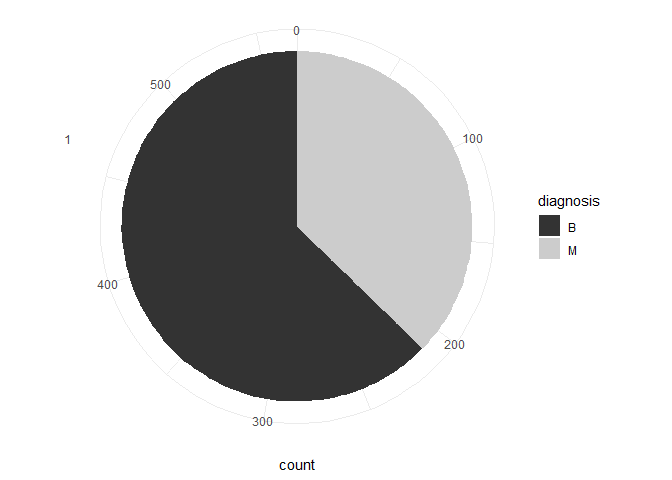<!-- -->

(Pt 6) The above graph is appropriate for the research question2.
However, an additional graph is plotted below since the instructions
require logarithmic axis scale. Logarithmic scale is appropriate when
order of magnitude difference is present between values, thus we select
variable ‘cancavity\_mean’ which has the highest order of magnitude
present; \~600x.

``` r
cancer_sample %>%
  arrange(radius_mean) %>%
  ggplot(aes(x=radius_mean, y=concavity_mean))+
  geom_point(aes(color=diagnosis), alpha=0.2)+
  theme_classic()+
  scale_y_continuous("Concavity (mean)", trans="log10", labels = scales::label_scientific())+
  annotation_logticks(sides = "l")
```

    ## Warning: Transformation introduced infinite values in continuous y-axis

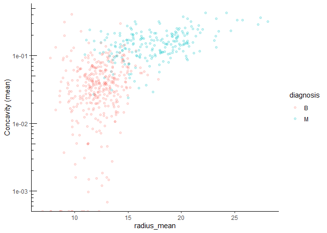<!-- -->

The above graph-being not a straight line-and having fairly distinct
regions for diagnosis class, delineates valuable insight that
radius\_mean and concavity\_mean do not have high co-llinearity. Thus
add variance to model which can benefit from multivariate analysis.

#### Question3 - Variable relationship w.r.t. response

(Pt 3) For effective classification, We will need to compute how other
variables are correlated to the response as well. First, we will
continue with above variable ‘concavity\_mean’ as an example to
demonstrate and fulfill report instructions. This numeric variable has a
wide range and is a good candidate for categorization into buckets. Then
in next report, we will summarize for all variables.

``` r
# Adding column for categorization of 'concavity_mean' into 4 buckets

(cancer_categ <- cancer_sample %>%
  mutate(concavity_mean_level = case_when(concavity_mean<0.04 ~ "Low",
                                         concavity_mean<0.08 ~ "Normal",
                                         concavity_mean<0.12 ~ "High",
                                         TRUE ~ "Very High")))
```

    ## # A tibble: 569 x 33
    ##          ID diagnosis radius_mean texture_mean perimeter_mean area_mean
    ##       <dbl> <chr>           <dbl>        <dbl>          <dbl>     <dbl>
    ##  1   842302 M                18.0         10.4          123.      1001 
    ##  2   842517 M                20.6         17.8          133.      1326 
    ##  3 84300903 M                19.7         21.2          130       1203 
    ##  4 84348301 M                11.4         20.4           77.6      386.
    ##  5 84358402 M                20.3         14.3          135.      1297 
    ##  6   843786 M                12.4         15.7           82.6      477.
    ##  7   844359 M                18.2         20.0          120.      1040 
    ##  8 84458202 M                13.7         20.8           90.2      578.
    ##  9   844981 M                13           21.8           87.5      520.
    ## 10 84501001 M                12.5         24.0           84.0      476.
    ## # ... with 559 more rows, and 27 more variables: smoothness_mean <dbl>,
    ## #   compactness_mean <dbl>, concavity_mean <dbl>, concave_points_mean <dbl>,
    ## #   symmetry_mean <dbl>, fractal_dimension_mean <dbl>, radius_se <dbl>,
    ## #   texture_se <dbl>, perimeter_se <dbl>, area_se <dbl>, smoothness_se <dbl>,
    ## #   compactness_se <dbl>, concavity_se <dbl>, concave_points_se <dbl>,
    ## #   symmetry_se <dbl>, fractal_dimension_se <dbl>, radius_worst <dbl>,
    ## #   texture_worst <dbl>, perimeter_worst <dbl>, area_worst <dbl>, ...

Re-plotting using categorized variable ‘concavity\_mean\_levels’:

``` r
# Using factors for visual appeal by having ascending order in bar proportion

cancer_categ %>%
  mutate(concavity_mean_level= factor(concavity_mean_level, levels = c("Low","Normal","High","Very High"))) %>%
  ggplot(aes(x = concavity_mean_level, fill=diagnosis))+
  geom_bar(position = "fill")+
  labs(y="Proportion")+
  theme_classic()
```

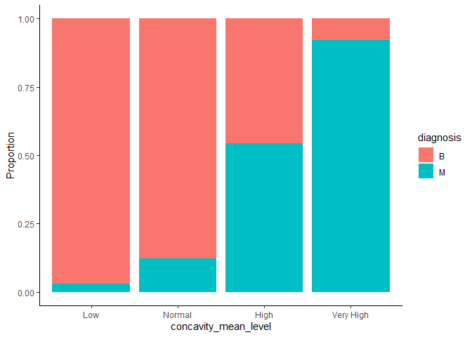<!-- -->

(Pt 8) We will continue to explore the independent variable relationship
with response. Now using histograms, with different bin sizes, for
another variable ‘concave\_points\_mean’:

``` r
#Bin size count is 20

cancer_sample %>%
  ggplot(aes(x = concave_points_mean, color=diagnosis))+
  geom_histogram(fill="white", bins = 20)+
  theme_classic()
```

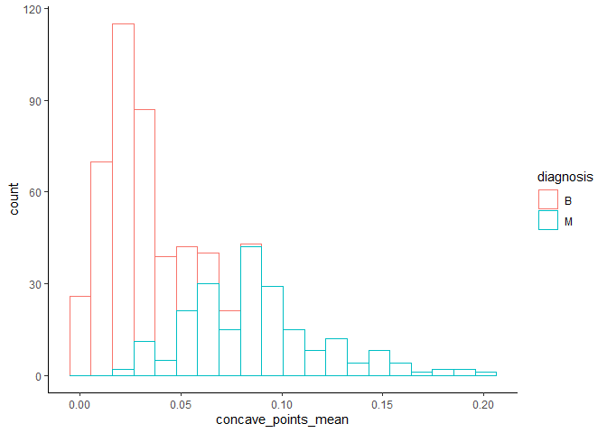<!-- -->

``` r
#Bin size count is 30

cancer_sample %>%
  ggplot(aes(x = concave_points_mean, color=diagnosis))+
  geom_histogram(fill="white", bins = 30)+
  theme_classic()
```

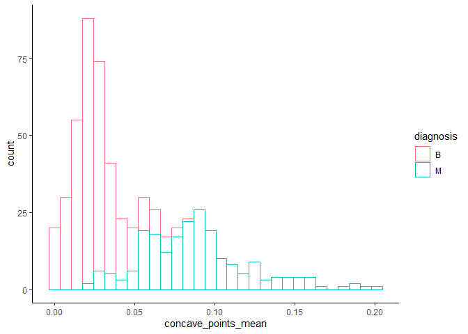<!-- -->

``` r
#Bin size count is 60

cancer_sample %>%
  ggplot(aes(x = concave_points_mean, color=diagnosis))+
  geom_histogram(fill="white", bins = 60)+
  theme_classic()
```

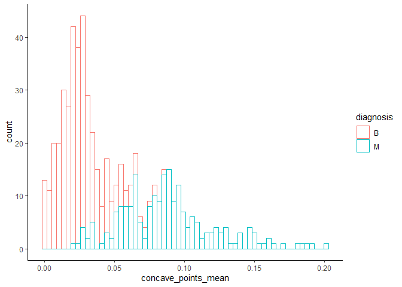<!-- -->

Thus we can see that even though there is overlap between the two
classes, there is still considerable separation that variable
‘concave\_points\_mean’ provides for bifurcation.

Additionally, bins=60 is the best as it is more detailed and doesn’t
overly smooth the multimodal peaks in data, which is the case with
bins=20. Bins=30 is also similar in smoothness to bins=60, however lacks
some details in the intersecting region.

#### Question4 - Relationship among closely related variables

(Pt 1) As mentioned above, this question has been updated since report1,
and we will examine the relationship across the three closely related
variables such as: ‘radius\_mean’, ‘radius\_se’, and ‘radius\_worst’.
The intention is to evaluate if there is high collinearity which can
assit in feature selection in report 3.

*Note: (Pt 4) is not much applicable to this dataset, therefore
repeating (pt 1) for this excercise:*

As in the above case with ‘radius\_mean’, we first use summary
statistics to check if ‘radius\_se’ and ‘radius\_worst’ are relevant
independent variables:

``` r
# Analyzing variable 'radius_se'

cancer_sample %>%
  group_by(diagnosis) %>%
  summarize(min_value=min(radius_se), max_value=max(radius_se), mean=mean(radius_se,na.rm=TRUE),median=median(radius_se), sd=sd(radius_se)) %>%
  unite(range, min_value, max_value, sep="-")
```

    ## # A tibble: 2 x 5
    ##   diagnosis range          mean median    sd
    ##   <chr>     <chr>         <dbl>  <dbl> <dbl>
    ## 1 B         0.1115-0.8811 0.284  0.258 0.113
    ## 2 M         0.1938-2.873  0.609  0.547 0.345

``` r
# Analyzing variable 'radius_worst'

cancer_sample %>%
  group_by(diagnosis) %>%
  summarize(min_value=min(radius_worst), max_value=max(radius_worst), mean=mean(radius_worst,na.rm=TRUE),median=median(radius_worst), sd=sd(radius_worst)) %>%
  unite(range, min_value, max_value, sep="-")
```

    ## # A tibble: 2 x 5
    ##   diagnosis range        mean median    sd
    ##   <chr>     <chr>       <dbl>  <dbl> <dbl>
    ## 1 B         7.93-19.82   13.4   13.4  1.98
    ## 2 M         12.84-36.04  21.1   20.6  4.28

We observe good distinction for mean and median values across the
diagnostic classes, and thus proceed to plot (Pt 7) the density graphs
and use alpha transparency to see the distribution intersections:

``` r
# For variable 'radius_mean'

cancer_sample %>%
  ggplot(aes(radius_mean))+
  geom_density(aes(fill=diagnosis, alpha=0.3))+
  theme_minimal()
```

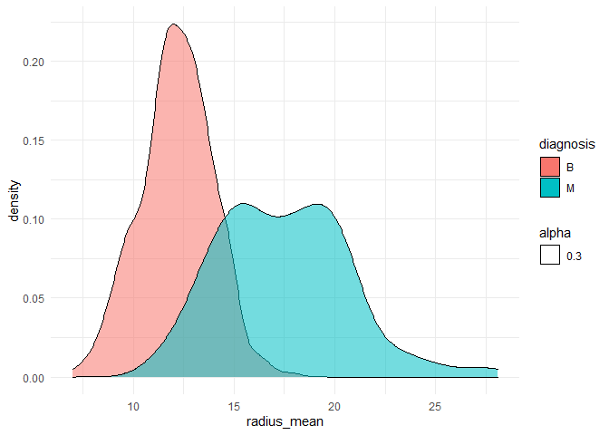<!-- -->

``` r
# For variable 'radius_se'

cancer_sample %>%
  ggplot(aes(radius_se))+
  geom_density(aes(fill=diagnosis, alpha=0.3))+
  theme_minimal()
```

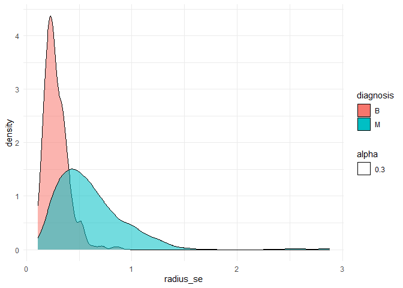<!-- -->

``` r
# For variable 'radius_worst'

cancer_sample %>%
  ggplot(aes(radius_worst))+
  geom_density(aes(fill=diagnosis, alpha=0.3))+
  theme_minimal()
```

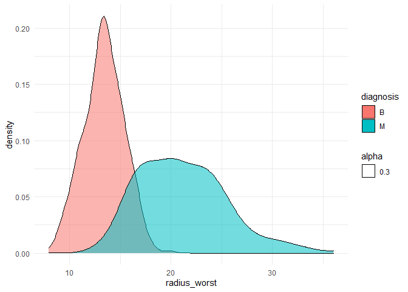<!-- -->

Since ‘radius\_worst’ and ‘radius\_mean’ seem to outperform
‘radius\_se’, we now proceed to check the correlation between them and
drop ‘radius\_se’.

``` r
cancer_sample %>%
  ggplot(aes(x=radius_mean, y=radius_worst))+
  geom_point(size=0.7, alpha=0.1)+
  geom_smooth()
```

    ## `geom_smooth()` using method = 'loess' and formula 'y ~ x'

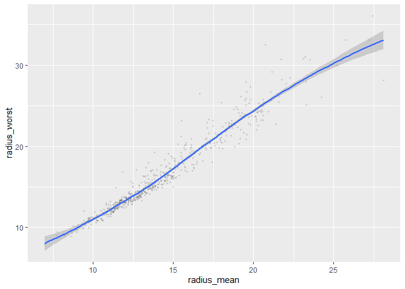<!-- -->

Visually, We can see high degree of correlation at the lower range, with
standard error increasing as the range increases. Since there is
variance, it is recommended to carry both these variables forward for
further analysis in report 3, in consideration of including in the model
features.

### Task 1.3: Learning

In summary, I have systematically examined:

-   The dataset at a high level (noting there are no missing values).
-   The various variables present and the possibility for them to act as
    features
-   The relationship between various independent variables that indicate
    a good performing model is possible

I am now certain of the research questions (1 question was updated).
Most interesting result was obtained by comparing the two classification
groups; which highlighted linear relationships within the group but one
that differed in rate of change compared intra-group.

**Next steps:**

-   Repeated some of the above steps for other variables and summarize
    outcomes quantitatively
-   Use statistical model and set parameters using the outcomes from
    above step to answer the central research question1 (binary
    classification)

## Task 2: Tidy Your Data

This section focus on reshaping data using the `tidyr` package in order
to simplify computation.

### Task 2.1: Sate of my dataset

My entire dataset (cancer\_sample) was by default present in tidy form
for my research questions. This is because:

-   Each row was an observation (incl. the response variable
    malignant/benign on individual row)
-   All columns represented variables
-   Each cell was (a particular) value

### Task 2.2: Reshaping my dataset

I will make my dataset untidy (for my research questions) by making the
tibble longer. I will collapse all features (such as radius\_mean,
area\_se, etc.) into one column. In another column I will have the
(numerical) values associated to those features. Thus, this will result
in a tibble with only 4 columns, with each row representing only one
parameter of a single observation. That is, one row, will no longer have
one complete observation data; which will be distributed over multiple
rows (three to be exact).

``` r
(cancer_long <- cancer_sample %>%
   pivot_longer(cols     = c(-ID, -diagnosis), 
               names_to  = "feature",
               values_to = "numerical_value"))
```

    ## # A tibble: 17,070 x 4
    ##        ID diagnosis feature                numerical_value
    ##     <dbl> <chr>     <chr>                            <dbl>
    ##  1 842302 M         radius_mean                    18.0   
    ##  2 842302 M         texture_mean                   10.4   
    ##  3 842302 M         perimeter_mean                123.    
    ##  4 842302 M         area_mean                    1001     
    ##  5 842302 M         smoothness_mean                 0.118 
    ##  6 842302 M         compactness_mean                0.278 
    ##  7 842302 M         concavity_mean                  0.300 
    ##  8 842302 M         concave_points_mean             0.147 
    ##  9 842302 M         symmetry_mean                   0.242 
    ## 10 842302 M         fractal_dimension_mean          0.0787
    ## # ... with 17,060 more rows

Now tidying the data back again:

``` r
(cancer_sample <- cancer_long %>%
   pivot_wider(id_cols     = c(ID, diagnosis), 
               names_from  = "feature",
               values_from = "numerical_value"))
```

    ## # A tibble: 569 x 32
    ##          ID diagnosis radius_mean texture_mean perimeter_mean area_mean
    ##       <dbl> <chr>           <dbl>        <dbl>          <dbl>     <dbl>
    ##  1   842302 M                18.0         10.4          123.      1001 
    ##  2   842517 M                20.6         17.8          133.      1326 
    ##  3 84300903 M                19.7         21.2          130       1203 
    ##  4 84348301 M                11.4         20.4           77.6      386.
    ##  5 84358402 M                20.3         14.3          135.      1297 
    ##  6   843786 M                12.4         15.7           82.6      477.
    ##  7   844359 M                18.2         20.0          120.      1040 
    ##  8 84458202 M                13.7         20.8           90.2      578.
    ##  9   844981 M                13           21.8           87.5      520.
    ## 10 84501001 M                12.5         24.0           84.0      476.
    ## # ... with 559 more rows, and 26 more variables: smoothness_mean <dbl>,
    ## #   compactness_mean <dbl>, concavity_mean <dbl>, concave_points_mean <dbl>,
    ## #   symmetry_mean <dbl>, fractal_dimension_mean <dbl>, radius_se <dbl>,
    ## #   texture_se <dbl>, perimeter_se <dbl>, area_se <dbl>, smoothness_se <dbl>,
    ## #   compactness_se <dbl>, concavity_se <dbl>, concave_points_se <dbl>,
    ## #   symmetry_se <dbl>, fractal_dimension_se <dbl>, radius_worst <dbl>,
    ## #   texture_worst <dbl>, perimeter_worst <dbl>, area_worst <dbl>, ...

### Task 2.3: Further selection of research question and data

Based on the above exercise and more in-depth knowledge about my dataset
now, I further select the following two questions:

1.  **Can a binary (malignant or benign) classification model be
    generated with the given variables and dataset size?**

In report 3, additional thought needs to be put in terms of
precision-recall, so performance evaluation is more robust given false
positive is better than false negative in this situation.

I have selected this as the primary question because it is the
culminating exercise that can provide the most utility from analysing
this data.

2.  **What variable(s) can be used to model the response?**

I have selected this as the second question because it is a requisite
pre-cursor to the primary question. Moreover, the model performance will
be heavily dictated by the set of features selected.

The other two questions were less important to further investigate as
they will already be intrinsically included in the model selection,
training, and tuning.

**Data set:** As discussed above, I need to drop all of the ten ’\_se’
cols:

``` r
(cancer_final <- cancer_sample %>%
  select(-radius_se, -texture_se, -perimeter_se, -area_se, -smoothness_se, -compactness_se, -concavity_se, -concave_points_se, -symmetry_se, -fractal_dimension_se) %>%
  arrange(diagnosis) %>%  # Arranging for better organization
  select(-ID) %>%   # Removing original ID column as number is non-consistent format
  mutate(ID = row_number()) %>%  # Adding consistent ID column
  select(ID, everything()))      # Moveing ID column as first col
```

    ## # A tibble: 569 x 22
    ##       ID diagnosis radius_mean texture_mean perimeter_mean area_mean
    ##    <int> <chr>           <dbl>        <dbl>          <dbl>     <dbl>
    ##  1     1 B               13.5          14.4           87.5      566.
    ##  2     2 B               13.1          15.7           85.6      520 
    ##  3     3 B                9.50         12.4           60.3      274.
    ##  4     4 B               13.0          18.4           82.6      524.
    ##  5     5 B                8.20         16.8           51.7      202.
    ##  6     6 B               12.0          14.6           78.0      449.
    ##  7     7 B               13.5          22.3           86.9      561 
    ##  8     8 B               11.8          21.6           74.7      428.
    ##  9     9 B               13.6          16.3           87.2      572.
    ## 10    10 B               11.9          18.2           75.7      438.
    ## # ... with 559 more rows, and 16 more variables: smoothness_mean <dbl>,
    ## #   compactness_mean <dbl>, concavity_mean <dbl>, concave_points_mean <dbl>,
    ## #   symmetry_mean <dbl>, fractal_dimension_mean <dbl>, radius_worst <dbl>,
    ## #   texture_worst <dbl>, perimeter_worst <dbl>, area_worst <dbl>,
    ## #   smoothness_worst <dbl>, compactness_worst <dbl>, concavity_worst <dbl>,
    ## #   concave_points_worst <dbl>, symmetry_worst <dbl>,
    ## #   fractal_dimension_worst <dbl>

My dataset is well formed and tidy, and does not have any missing
values; hence does not require any further manipulation to be used on
report3. However, to meet the instruction requirements, I hypothetically
manipulate data below to showcase familiarity using other functions, as
asked:

``` r
(cancer_final%>%
  filter(diagnosis=="M", radius_mean > 20)) # Selecting only observations associated to 'malignant' diagnosis class with radius_mean greater than 20
```

    ## # A tibble: 45 x 22
    ##       ID diagnosis radius_mean texture_mean perimeter_mean area_mean
    ##    <int> <chr>           <dbl>        <dbl>          <dbl>     <dbl>
    ##  1   359 M                20.6         17.8           133.      1326
    ##  2   362 M                20.3         14.3           135.      1297
    ##  3   378 M                21.2         23.0           137.      1404
    ##  4   413 M                20.2         24.0           144.      1245
    ##  5   414 M                25.2         24.9           172.      1878
    ##  6   421 M                20.3         23.0           132.      1264
    ##  7   425 M                22.3         19.7           153.      1509
    ##  8   430 M                24.2         20.2           166.      1761
    ##  9   444 M                23.3         22.0           152.      1686
    ## 10   450 M                27.2         21.9           182.      2250
    ## # ... with 35 more rows, and 16 more variables: smoothness_mean <dbl>,
    ## #   compactness_mean <dbl>, concavity_mean <dbl>, concave_points_mean <dbl>,
    ## #   symmetry_mean <dbl>, fractal_dimension_mean <dbl>, radius_worst <dbl>,
    ## #   texture_worst <dbl>, perimeter_worst <dbl>, area_worst <dbl>,
    ## #   smoothness_worst <dbl>, compactness_worst <dbl>, concavity_worst <dbl>,
    ## #   concave_points_worst <dbl>, symmetry_worst <dbl>,
    ## #   fractal_dimension_worst <dbl>
