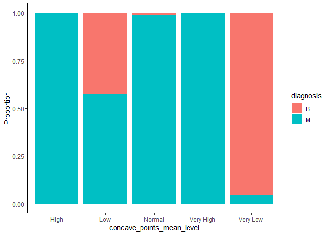
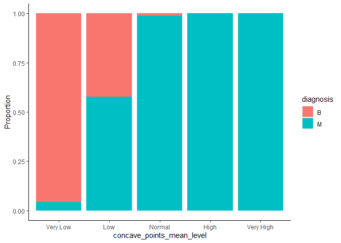

Mini Data Analysis: Report 3
================
Harsh Sharma
28/10/2021

## Overview

This report continues the exploratory data analysis performed in Report
1 and 2 on the ‘cancer\_dataset’ chosen from the `datateacher` package.
Incremental effort has been placed in exploring the dataset in a fashion
that will lead to generating insights. In this culminating report, the
results are further improved - enabling the answering of research
questions.

## Set-up

First we need to load the following two packages:

``` r
# Installing packages if missing, required only once
# install.packages("devtools")
# devtools::install_github("UBC-MDS/datateachr")

library(datateachr)
library(tidyverse)
library(forcats)
library(here)
```

Following are the two research questions continued forward from report
2:

1.  Can a binary (malignant or benign) classification model be generated
    with the given variable(s) and data set size?

2.  What variable(s) can be used to model the response?

## Exercise 1: Special Data Types

### Task 1: Plotting using reordering of factors

Incidentally, I already performed this task in report 2 (task 1.2,
question 3). Therefore, this time I will re-perform the task with a
different variable because that contributes knowledge in regards to my
2<sup>nd</sup> research question around identifying independent
variables.

Using the final data set created in the end of report2:

``` r
# From report 2 we know that '_se' columns do not contribute to our research questions and hence 10 columns will be dropped

(cancer_final <- cancer_sample %>%
  select(-radius_se, -texture_se, -perimeter_se, -area_se, -smoothness_se, -compactness_se, -concavity_se, -concave_points_se, -symmetry_se, -fractal_dimension_se) %>%
  arrange(diagnosis) %>%  # Arranging for better organization
  select(-ID) %>%   # Removing original ID column as number is non-consistent format
  mutate(ID = row_number()) %>%  # Adding consistent ID column
  select(ID, everything()))      # Moving ID column as first col
```

    ## # A tibble: 569 x 22
    ##       ID diagnosis radius_mean texture_mean perimeter_mean area_mean
    ##    <int> <chr>           <dbl>        <dbl>          <dbl>     <dbl>
    ##  1     1 B               13.5          14.4           87.5      566.
    ##  2     2 B               13.1          15.7           85.6      520 
    ##  3     3 B                9.50         12.4           60.3      274.
    ##  4     4 B               13.0          18.4           82.6      524.
    ##  5     5 B                8.20         16.8           51.7      202.
    ##  6     6 B               12.0          14.6           78.0      449.
    ##  7     7 B               13.5          22.3           86.9      561 
    ##  8     8 B               11.8          21.6           74.7      428.
    ##  9     9 B               13.6          16.3           87.2      572.
    ## 10    10 B               11.9          18.2           75.7      438.
    ## # ... with 559 more rows, and 16 more variables: smoothness_mean <dbl>,
    ## #   compactness_mean <dbl>, concavity_mean <dbl>, concave_points_mean <dbl>,
    ## #   symmetry_mean <dbl>, fractal_dimension_mean <dbl>, radius_worst <dbl>,
    ## #   texture_worst <dbl>, perimeter_worst <dbl>, area_worst <dbl>,
    ## #   smoothness_worst <dbl>, compactness_worst <dbl>, concavity_worst <dbl>,
    ## #   concave_points_worst <dbl>, symmetry_worst <dbl>,
    ## #   fractal_dimension_worst <dbl>

Now, creating 5 categories for the variable ‘concave\_points\_mean’
numerical data:

``` r
# Adding column for categorization of 'concavity_mean' into 5 buckets
(cancer_categorical <- cancer_final %>%
  mutate(concave_points_mean_level = case_when(concave_points_mean<0.04 ~ "Very Low",
                                         concave_points_mean<0.08 ~ "Low",
                                         concave_points_mean<0.12 ~ "Normal",
                                         concave_points_mean<0.16 ~ "High",
                                         TRUE ~ "Very High")))
```

    ## # A tibble: 569 x 23
    ##       ID diagnosis radius_mean texture_mean perimeter_mean area_mean
    ##    <int> <chr>           <dbl>        <dbl>          <dbl>     <dbl>
    ##  1     1 B               13.5          14.4           87.5      566.
    ##  2     2 B               13.1          15.7           85.6      520 
    ##  3     3 B                9.50         12.4           60.3      274.
    ##  4     4 B               13.0          18.4           82.6      524.
    ##  5     5 B                8.20         16.8           51.7      202.
    ##  6     6 B               12.0          14.6           78.0      449.
    ##  7     7 B               13.5          22.3           86.9      561 
    ##  8     8 B               11.8          21.6           74.7      428.
    ##  9     9 B               13.6          16.3           87.2      572.
    ## 10    10 B               11.9          18.2           75.7      438.
    ## # ... with 559 more rows, and 17 more variables: smoothness_mean <dbl>,
    ## #   compactness_mean <dbl>, concavity_mean <dbl>, concave_points_mean <dbl>,
    ## #   symmetry_mean <dbl>, fractal_dimension_mean <dbl>, radius_worst <dbl>,
    ## #   texture_worst <dbl>, perimeter_worst <dbl>, area_worst <dbl>,
    ## #   smoothness_worst <dbl>, compactness_worst <dbl>, concavity_worst <dbl>,
    ## #   concave_points_worst <dbl>, symmetry_worst <dbl>,
    ## #   fractal_dimension_worst <dbl>, concave_points_mean_level <chr>

Plotting using categorized variable ‘concavity\_mean\_levels’:

``` r
# Using factors for visual appeal by having ascending order in bar proportion

cancer_categorical %>%
  ggplot(aes(x = concave_points_mean_level, fill=diagnosis))+
  geom_bar(position = "fill")+
  labs(y="Proportion")+
  theme_classic()
```

<!-- -->

As observed, the x-axis, by default is alphabetically arranged. This
should be arranged differently to better communicate the visual
insights. Since we plot categorical data, we will use factors for
re-alignment as follows:

``` r
# First converting the 'char' col into a factor col

cancer_categorical$concave_points_mean_level <- as.factor(cancer_categorical$concave_points_mean_level)
head(cancer_categorical$concave_points_mean_level)
```

    ## [1] Low      Very Low Very Low Very Low Very Low Very Low
    ## Levels: High Low Normal Very High Very Low

``` r
# Using factors for visual appeal by having ascending order in bar proportion

cancer_categorical <- cancer_categorical %>%
    mutate(concave_points_mean_level = fct_reorder(concave_points_mean_level, radius_mean, mean))

cancer_categorical %>%
    ggplot(aes(x = concave_points_mean_level, fill=diagnosis))+
    geom_bar(position = "fill")+
    labs(y="Proportion")+
    theme_classic()
```

<!-- -->

I intentionally did not manually set the factor levels in order from
very low to very high, or vice versa, because it should be dynamic.
Setting it manually is static and the user also needs to plot and see if
the intended visual outcome is achieved. In this case, the manual
ordering also works however required user check. In stead, I use
relationship with other variable ‘radius\_mean’ to achieve the ordering.
This is logical as in previous report it is shown that ‘radius\_mean’ is
correlated to malignant/benign diagnosis. Above plot delineates: as we
proceed from very low to very high categories of ‘concave\_mean\_points’
the proportion of malign diagnosis also increases. Thus,
‘concave\_mean\_points’ is also a good predictor for diagnosis.
