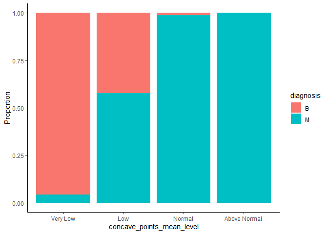

Mini Data Analysis: Report 3
================
Harsh Sharma
28/10/2021

## Overview

This report continues the exploratory data analysis performed in Report
1 and 2 on the ‘cancer\_dataset’ chosen from the `datateacher` package.
Incremental effort has been placed in exploring the dataset in a fashion
that will lead to generating insights. In this culminating report, the
results are further improved - enabling the answering of research
questions.

## Set-up

First we need to load the following packages:

``` r
# Installing packages if missing, required only once
# install.packages("devtools")
# devtools::install_github("UBC-MDS/datateachr")

library(datateachr)
library(tidyverse)
library(forcats)
library(here)
```

Two research questions continued forward from report 2 are:

1.  Can a binary (malignant or benign) classification model be generated
    with the given variable(s) and data set size?

2.  What variable(s) can be used to model the response?

## Exercise 1: Special Data Types

### Task 1: Plotting using reordering of factors

Incidentally, I already performed this task in report 2 (task 1.2,
question 3), but set the levels manually. Therefore, this time I will
re-perform the task with a different variable because that contributes
knowledge in regards to my 2<sup>nd</sup> research question around
identifying independent variables, and use `forcats` package.

Using the final data set created in the end of report2:

``` r
# From report 2 we know that '_se' columns do not contribute to our research questions
# Hence 10 columns will be dropped

(cancer_final <- cancer_sample %>%
  select(-radius_se, -texture_se, -perimeter_se, -area_se, -smoothness_se, -compactness_se, -concavity_se, -concave_points_se, -symmetry_se, -fractal_dimension_se) %>%
  arrange(diagnosis) %>%  # Arranging for better organization
  select(-ID) %>%   # Removing original ID column as number is non-consistent format
  mutate(ID = row_number()) %>%  # Adding consistent ID column
  select(ID, everything()))      # Moving ID column as first col
```

    ## # A tibble: 569 x 22
    ##       ID diagnosis radius_mean texture_mean perimeter_mean area_mean
    ##    <int> <chr>           <dbl>        <dbl>          <dbl>     <dbl>
    ##  1     1 B               13.5          14.4           87.5      566.
    ##  2     2 B               13.1          15.7           85.6      520 
    ##  3     3 B                9.50         12.4           60.3      274.
    ##  4     4 B               13.0          18.4           82.6      524.
    ##  5     5 B                8.20         16.8           51.7      202.
    ##  6     6 B               12.0          14.6           78.0      449.
    ##  7     7 B               13.5          22.3           86.9      561 
    ##  8     8 B               11.8          21.6           74.7      428.
    ##  9     9 B               13.6          16.3           87.2      572.
    ## 10    10 B               11.9          18.2           75.7      438.
    ## # ... with 559 more rows, and 16 more variables: smoothness_mean <dbl>,
    ## #   compactness_mean <dbl>, concavity_mean <dbl>, concave_points_mean <dbl>,
    ## #   symmetry_mean <dbl>, fractal_dimension_mean <dbl>, radius_worst <dbl>,
    ## #   texture_worst <dbl>, perimeter_worst <dbl>, area_worst <dbl>,
    ## #   smoothness_worst <dbl>, compactness_worst <dbl>, concavity_worst <dbl>,
    ## #   concave_points_worst <dbl>, symmetry_worst <dbl>,
    ## #   fractal_dimension_worst <dbl>

Now, creating 5 categories for the numerical variable
‘concave\_points\_mean’:

``` r
# Adding column for categorization of 'concavity_mean' into 5 buckets
(cancer_categorical <- cancer_final %>%
  mutate(concave_points_mean_level = case_when(concave_points_mean<0.04 ~ "Very Low",
                                         concave_points_mean<0.08 ~ "Low",
                                         concave_points_mean<0.12 ~ "Normal",
                                         concave_points_mean<0.16 ~ "High",
                                         TRUE ~ "Very High")))
```

    ## # A tibble: 569 x 23
    ##       ID diagnosis radius_mean texture_mean perimeter_mean area_mean
    ##    <int> <chr>           <dbl>        <dbl>          <dbl>     <dbl>
    ##  1     1 B               13.5          14.4           87.5      566.
    ##  2     2 B               13.1          15.7           85.6      520 
    ##  3     3 B                9.50         12.4           60.3      274.
    ##  4     4 B               13.0          18.4           82.6      524.
    ##  5     5 B                8.20         16.8           51.7      202.
    ##  6     6 B               12.0          14.6           78.0      449.
    ##  7     7 B               13.5          22.3           86.9      561 
    ##  8     8 B               11.8          21.6           74.7      428.
    ##  9     9 B               13.6          16.3           87.2      572.
    ## 10    10 B               11.9          18.2           75.7      438.
    ## # ... with 559 more rows, and 17 more variables: smoothness_mean <dbl>,
    ## #   compactness_mean <dbl>, concavity_mean <dbl>, concave_points_mean <dbl>,
    ## #   symmetry_mean <dbl>, fractal_dimension_mean <dbl>, radius_worst <dbl>,
    ## #   texture_worst <dbl>, perimeter_worst <dbl>, area_worst <dbl>,
    ## #   smoothness_worst <dbl>, compactness_worst <dbl>, concavity_worst <dbl>,
    ## #   concave_points_worst <dbl>, symmetry_worst <dbl>,
    ## #   fractal_dimension_worst <dbl>, concave_points_mean_level <chr>

Now plotting using the newly created categorical variable
‘concavity\_mean\_levels’:

``` r
cancer_categorical %>%
  ggplot(aes(x = concave_points_mean_level, fill=diagnosis))+
  geom_bar(position = "fill")+
  labs(y="Proportion")+
  theme_classic()
```

<!-- -->

As observed, the x-axis, by default is alphabetically arranged. This
should be arranged differently to better communicate the visual
insights. Since we plot categorical data, we will use factors for
re-alignment as follows:

``` r
# First converting the 'char' col into a factor col
cancer_categorical$concave_points_mean_level <- as.factor(cancer_categorical$concave_points_mean_level)
head(cancer_categorical$concave_points_mean_level)
```

    ## [1] Low      Very Low Very Low Very Low Very Low Very Low
    ## Levels: High Low Normal Very High Very Low

``` r
# Using factors for visual appeal by having ascending order in bar proportion

cancer_categorical <- cancer_categorical %>%
    mutate(concave_points_mean_level = fct_reorder(concave_points_mean_level, radius_mean, mean))

cancer_categorical %>%
    ggplot(aes(x = concave_points_mean_level, fill=diagnosis))+
    geom_bar(position = "fill")+
    labs(y="Proportion")+
    theme_classic()
```

<!-- -->

I intentionally did not manually set the factor order from very low to
very high, or vice versa, because it should be dynamic. Not only is
manual setting static but the user also needs to first plot and see if
the intended visual outcome is achieved (uniformly trending
proportions). In this particular case, the manual ordering as stated
above also works, however, is not best practice.

Instead, **I use relationship with other variable ‘radius\_mean’ to
achieve the ordering**. This is logical, as in previous report it is
shown that ‘radius\_mean’ is correlated to malignant/benign diagnosis.

Above plot delineates **as we proceed from very low to very high
categories of ‘concave\_mean\_points’ the proportion of malign diagnosis
also increases**. Thus, ‘concave\_mean\_points’ is also a good predictor
for diagnosis.

### Task 2: Combining of factor levels

In the above plot, we can see there is no difference in high and very
high category as they have the exact proportion. That is, no incremental
value is added by using the extra pixels and space on the plot. To make
it cleaner, we combine the aforementioned categories using
‘fct\_collapse’. By grouping these two categories together we have not
impacted the relay of information to the reader.

``` r
# Collapsing factors for visual appeal

cancer_categorical %>%
        mutate(concave_points_mean_level = fct_collapse(concave_points_mean_level, "Above Normal" = c("High", "Very High"))) %>%
    ggplot(aes(x = concave_points_mean_level, fill=diagnosis))+
    geom_bar(position = "fill")+
    labs(y="Proportion")+
    theme_classic()
```

<!-- -->

## Exercise 2: Modelling

Selection is as follows:

-   **Research question:** Can a binary (malignant or benign)
    classification model be generated with the given variable(s)?
-   **Variable of interest:** Diagnosis (malignant or benign)

### Task 2.1: Fitting data to a model

Binary logistic regression is used for the classification task. We will
first split the data set into training and test set so that we are able
to predict on unseen data in the next task.

``` r
# Need to convert diagnosis values for "M" and "B" to 1 and 0 respectively
# So that glm model can except numerical data required for logit regression
cancer_categorical<-cancer_categorical %>%
  mutate(diagnosis_numerical = case_when(diagnosis == "M" ~ 1,
                                         diagnosis == "B" ~ 0,))

# Creating test-train (20%-80%) sets by randomly splitting data
count_train <- round(0.8 * nrow(cancer_categorical)) 
set.seed(100)
training_index <- sample(1:nrow(cancer_categorical), count_train)
training_set <- cancer_categorical[training_index, ]
test_set <- cancer_categorical[-training_index, ]

# Fitting the model using training set
model <- glm(diagnosis_numerical ~ radius_mean + concave_points_mean, data = training_set, family = "binomial")

#Printing model output to screen
model
```

    ## 
    ## Call:  glm(formula = diagnosis_numerical ~ radius_mean + concave_points_mean, 
    ##     family = "binomial", data = training_set)
    ## 
    ## Coefficients:
    ##         (Intercept)          radius_mean  concave_points_mean  
    ##            -13.6709               0.6478              83.1777  
    ## 
    ## Degrees of Freedom: 454 Total (i.e. Null);  452 Residual
    ## Null Deviance:       600.3 
    ## Residual Deviance: 173.1     AIC: 179.1

### Task 2.2: Predicting using the fitted model

Now the above fitted model is used on test set to predict the ‘Y’
i.e. the diagnosis.

Then, the model performance is assessed through the following
statistics:

-   Accuracy
-   Precision
-   Recall

Lastly, the fitted model is also analyzed using `broom` package to
validate the assumptions previously made for independent variables
through their p-values.

``` r
# Predicting on the 20% test set
prediction_temp <- predict(model, test_set, type = "response") #Using type=response to output probabilities in place of logit data
prediction <- round(prediction_temp) #Rounding off value to match numerical diagnosis classification

#Renaming vector values to align with initial diagnosis naming of "M" and "B"
prediction[prediction==0] <- "B"
prediction[prediction==1] <- "M"

#Printing results in a tabular form
(confusion_matrix_table <-table("Predicted Values" = prediction, "Reference Values" = test_set$diagnosis))
```

    ##                 Reference Values
    ## Predicted Values  B  M
    ##                B 64  4
    ##                M  7 39

``` r
# Converting the above table to a tibble
(confusion_matrix <- as_tibble(confusion_matrix_table))
```

    ## # A tibble: 4 x 3
    ##   `Predicted Values` `Reference Values`     n
    ##   <chr>              <chr>              <int>
    ## 1 B                  B                     64
    ## 2 M                  B                      7
    ## 3 B                  M                      4
    ## 4 M                  M                     39

Calculating statistic values manually:

-   **Accuracy:** 83.1%
-   **Precision:** 84.8%
-   **Recall:** 90.7%

These are decent results for a simple model used.

``` r
# Summarizing information about model to validate initial indicative results from plots in report 2 and 3.
(ans2.2 <- broom::tidy(model))
```

    ## # A tibble: 3 x 5
    ##   term                estimate std.error statistic  p.value
    ##   <chr>                  <dbl>     <dbl>     <dbl>    <dbl>
    ## 1 (Intercept)          -13.7       1.75      -7.79 6.63e-15
    ## 2 radius_mean            0.648     0.121      5.37 7.71e- 8
    ## 3 concave_points_mean   83.2      10.8        7.73 1.07e-14

Using `broom` package, we can see above that both independent variables
have p-values &lt; 0.05, and thus positively influence the response
variable ‘diagnosis’. This validates we have correctly selected our set
of variables.

## Exercise 3: Reading and writing data

### Task 3.1: Writing data to csv file

Using the summary table (below) from report 2, we save it to output
folder as a csv.

``` r
# Generating the summary table, first grouping by diagnosis
# Using dyplr::unite() to output range as asked in question

(task3.1 <- cancer_sample %>%
  group_by(diagnosis) %>%
  summarize(min_value=min(radius_mean), max_value=max(radius_mean), mean=mean(radius_mean,na.rm=TRUE),median=median(radius_mean), sd=sd(radius_mean)) %>%
  unite(range, min_value, max_value, sep="-"))
```

    ## # A tibble: 2 x 5
    ##   diagnosis range        mean median    sd
    ##   <chr>     <chr>       <dbl>  <dbl> <dbl>
    ## 1 B         6.981-17.85  12.1   12.2  1.78
    ## 2 M         10.95-28.11  17.5   17.3  3.20

``` r
# Saving as a csv
write_csv(task3.1, here::here("Output", "summary_table.csv"))

# File check
dir(here::here("output"))
```

    ## [1] "classification-model.rds" "README.md"               
    ## [3] "summary_table.csv"

### Task 3.2: Saving and reading model object

We will save model in ‘Output’ folder using function ‘saveRDS()’ and
then load it back using ‘readRDS()’ function.

``` r
# Saving model object
saveRDS(model, file = here::here("Output", "classification-model.rds"))

# File check
dir(here::here("output"))
```

    ## [1] "classification-model.rds" "README.md"               
    ## [3] "summary_table.csv"

``` r
# Loading the saved model
classifier <- readRDS(here::here("Output", "classification-model.rds"))

# Printing the loaded object to check                      
classifier
```

    ## 
    ## Call:  glm(formula = diagnosis_numerical ~ radius_mean + concave_points_mean, 
    ##     family = "binomial", data = training_set)
    ## 
    ## Coefficients:
    ##         (Intercept)          radius_mean  concave_points_mean  
    ##            -13.6709               0.6478              83.1777  
    ## 
    ## Degrees of Freedom: 454 Total (i.e. Null);  452 Residual
    ## Null Deviance:       600.3 
    ## Residual Deviance: 173.1     AIC: 179.1
